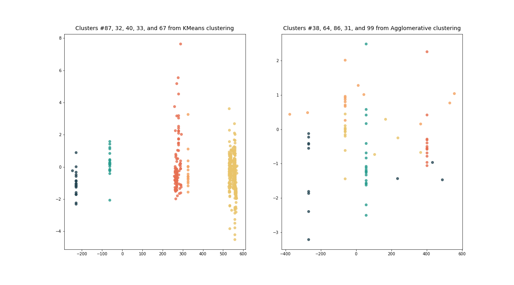
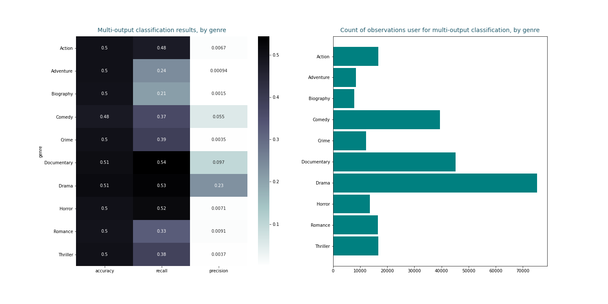

# Movie-mania

---------
### Problem Statement

This project is an exercise in leveraging features from text using a dataset previously harvested for the purpose of predicting Academy Awards nominations and wins. 
Specifically, it demonstrates: 
- clustering of movies to assess what groupings the ML algorithm would find based on movie descriptions (`summary`);
- multi-label classification of movies by genre (where each movie can represent more than one genre), using first movie titles (`primaryTitle`) and then - movie summaries.

--------
### Summary

Section #2 of the movie-topics notebook is focused on clustering: using features bases on summaries of movie plots (text converted into a word vector for each movie), I applied three types of clustering algorithms: 1) centroid-based K-Means, 2) density-based DBSCAN, and 3) hierarchical Agglomerative Clustering to group movies into collections which the algorithms deemed similar.

While none of the trained clustering models achieved silhouette scores indicating high homogeneity within formed clusters and meaningful differences between separate clusters, a review of randomly picked groupings confirmed that the groupings shared some logical characteristics (e.g. coming of age stories or documentaries about war).

Section #3 of the same notebook contains two attempts at training a multi-label classifier, first leveraging text-based features extracted from movie titles, then utilizing features extracted from plot summaries, where labels are ten popular genres represented by movies in the dataset. Each movie in the dataset on which the models were trained represents one, two, or three genres.

The average accuracy score for the classifier trained on titles was ..., with genres more represented in the training set achieving much better results: ... for Drama, ... for Comedy, and ... for ...
Surprisingly, the average accuracy score for the classifier trained on summaries was nearly the same: .... Similarly to what's been observed above, genres with more than 30,000 observations in the data set were recognized more accurately:

----------------
### Possible Project Extensions

Future exploration might include:

- Tuning the hyperparameters of the word vectorizer (e.g. to account for longer phrases like 4-grams or 5-grams, to find better thresholds for trimming the vocabulary, or to apply the term frequency-inverse - - - Document frequency logic) and the multi-output classifier (e.g. by adjusting the number of neighbors),
- Training a neural network to more accurately perform the same multi-output classification task,
- Training a multi-output classifier with estimator objects other than KNC (e.g. Decision Tree),
- Using a combination of summary and title in predicting the genre,
- Training a binary classifier to only classify one genre at a time.
